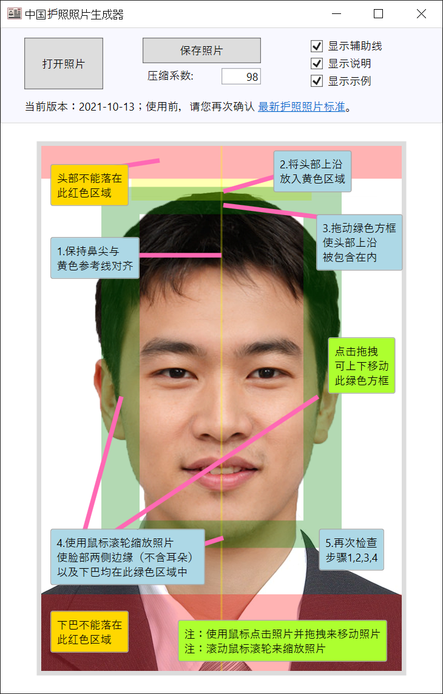

<!--
*** Thanks for checking out the Best-README-Template. If you have a suggestion
*** that would make this better, please fork the repo and create a pull request
*** or simply open an issue with the tag "enhancement".
*** Don't forget to give the project a star!
*** Thanks again! Now go create something AMAZING! :D
-->

<!-- PROJECT SHIELDS -->
<!--
*** I'm using markdown "reference style" links for readability.
*** Reference links are enclosed in brackets [ ] instead of parentheses ( ).
*** See the bottom of this document for the declaration of the reference variables
*** for contributors-url, forks-url, etc. This is an optional, concise syntax you may use.
*** https://www.markdownguide.org/basic-syntax/#reference-style-links
-->
[![Contributors][contributors-shield]][contributors-url]
[![Forks][forks-shield]][forks-url]
[![Stargazers][stars-shield]][stars-url]
[![Issues][issues-shield]][issues-url]
[![MIT License][license-shield]][license-url]
[![LinkedIn][linkedin-shield]][linkedin-url]

<!-- PROJECT LOGO -->
 

  

<h3 align="center">中国护照照片生成器</h3>

  

    不需要任何图像处理知识，只需要简单的动动鼠标，就可以快速生成符合标准的中国护照照片。
     
    <strong>注：目前仅支持运行在Windows平台。</strong>
     
     
    <a href="https://github.com/hjt486/ChinesePassportPhotoMaker/blob/main/build/%E4%B8%AD%E5%9B%BD%E6%8A%A4%E7%85%A7%E7%85%A7%E7%89%87%E7%94%9F%E6%88%90%E5%99%A8.zip"><strong>{ 点击下载程序 }</strong></a>
     
    <a href="https://www.youtube.com/watch?v=Q86svYysahA"><strong>{ 点击查看视频教程 }</strong></a>
    <!--
     
    <a href="https://github.com/github_username/repo_name"><strong>Explore the docs »</strong></a>
     
     
    <a href="https://github.com/github_username/repo_name">View Demo</a>
    ·
    <a href="https://github.com/github_username/repo_name/issues">Report Bug</a>
    ·
    <a href="https://github.com/github_username/repo_name/issues">Request Feature</a>
	-->
  

<!-- ABOUT THE PROJECT -->
## 简介

    

疫情开始以来，世界各地的中国使领馆均改变了对外办公的时间和方式，使得护照到期换发变的更加麻烦。以前经常有朋友抱怨使领馆对于照片的要求过于苛刻，很多通过第三方拍摄的照片都无法通过验证，但是疫情前的使领馆内部或附近都有相应的自助照片拍摄机器，或者了解相关标准的第三方摄影馆，除了额外的费用和一定的时间成本，绝大多数的情况下并不会耽误护照换发申请流程。如今因为很多使领馆不对外开放，同时引入了领事服务App，因此申请人需要在申请前期就要上传符合标准的照片，即便照片通过了初步验证，如果不符合具体要求，依然可能在后期审核过程中被拒绝，极大程度上增加了不确定性和时间成本。实际上，中国外交部领事服务网上发布的关于护照照片的标准非常清晰和详细，对于照片上人像的各种距离、大小均有明确的规定，但是对于绝大多数人，这些枯燥和详细的数字只是增加了理解的难度，同时因为缺乏处理照片的相关知识，使得很多人感觉无从下手又不知道去哪里寻求帮助。这个程序的存在，就是为了帮助大家化繁为简，用清晰明了的可视化的方式快速生成符合标准的照片。

(<a href="#top">回到页首</a>)

### Built With

* Visual Studio 2019
* .NET Core 3.1
* WPF

(<a href="#top">回到页首</a>)

<!--
<!-- GETTING STARTED -->